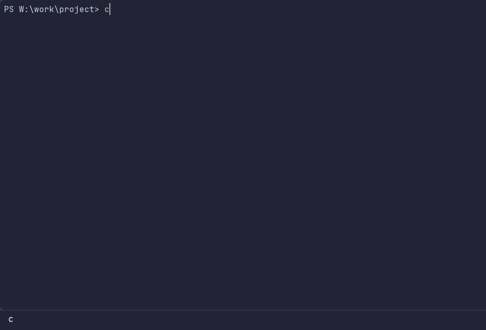

# tadoru

[English](README.md)

**tadoru**（辿る）は、cmd.exe / PowerShell / bash で同じ操作感のディレクトリ移動ツール。
数文字打って Enter で目的地へ辿り着き、階層を 1 段ずつ辿ることもできる。Rust + ratatui。


- フォルダ名を覚えている: `c openssl`
- ファイル名だけ分かる: `cf Cargo.toml` で、そのファイルの親フォルダへ移動
- 名前を知らず中を見たい: `c` を開き、Tab で browse に切り替える

`c`・`cf`・browse・favorites は本体だけで動く。
履歴を使う `z`・`zi`・recent には `zoxide` が要る（無い場合は画面で案内する）。

配布しているのは Windows と Linux の x86_64 版。[リリース](../../releases)から取得する。
macOS 向けのコードはあるが、ビルドも動作確認もしていない。

## fd + fzf との関係

もとは PowerShell で使っていた fd + fzf の関数（`c` / `cf`）。作り直した理由は 2 つある。
1 つは cmd.exe でも同じ操作で使いたかったこと。もう 1 つは、上の階層から探し直すたびに
抜けて `cd ..` し、開き直すのが面倒だったこと。
見た目は fzf の既定の配色と並びに合わせている。fd・fzf のコードは使っていない。

fd + fzf は、一覧を絞り込んで選んだパスを出力するところまでを受け持つ。cd はシェル側でつなぐ。
PowerShell か bash だけを使い、fd と fzf を入れられる環境なら、それで足りることが多い。
tadoru が役に立つのは次のような場合。

- cmd.exe でも同じ操作で cd したい。バッチでつなぐと `^` `&` `|` や引用符で壊れやすい
- 探す範囲を画面の中で動かしたい。Left で起点を 1 段広げ、3 列表示で辿った先はそのまま起点になる。
  変わった起点は Ctrl+← で戻せる
- 実行ファイル 1 つで済ませたい。fd と fzf を別に入れなくてよい
- お気に入りやアクションメニューも同じ画面で使いたい

## 導入

| コマンド | 何をするか |
|---|---|
| `tadoru setup` | PowerShell / bash の起動ファイルに設定を 1 ブロック追記する |
| `tadoru init cmd --out` | `c.cmd` `cf.cmd` `z.cmd` `zi.cmd` を出力する |
| `tadoru init powershell --out` | `c.ps1` `cf.ps1` `z.ps1` `zi.ps1` を出力する |

出力先は `tadoru.exe` と同じフォルダ。`--out` の後ろにフォルダを書けば変えられる。

PowerShell と bash は `setup` だけでよい。zsh は `~/.zshrc` に手で書く（[導入の詳細（英語）](docs/guide/setup.md#setting-it-up-by-hand)）。
cmd.exe には起動時に読むファイルが無いので
`init cmd --out` を使い、出力したフォルダを PATH に入れる。
`.ps1` はプロファイルを触りたくない場合の代替で、zoxide を入れていると
`z` と `zi` を置き換えられない。

`setup` は書き込む内容と対象ファイルを表示してから確認を求める。`--yes` で省ける。
シェルは環境から判定する。追記するのは目印で囲んだ 1 ブロックだけで、再実行しても増えない。
やめるときは目印から目印までを消す。

名前は既定で `c` `cf` `z` `zi`。同じ名前のコマンドがすでに PATH にあれば、`setup` と
`init --out` がその場所を表示する。`--cmd j` を付けると `j` と `jf` になり、`--no-z` を付けると
zoxide の `z` と `zi` には手を付けない。詳しくは[導入の詳細（英語）](docs/guide/setup.md#changing-the-command-names)。

リリースの zip には exe と上の 8 本が入っているので、展開して PATH に入れるだけでよい。
リポジトリから使う場合は先にビルドする。[開発](#開発)を参照。

手作業で設定したい場合や、`init` が出す内容そのものは
[導入の詳細（英語）](docs/guide/setup.md)を参照。

## コマンド

| コマンド | 動作 |
|---|---|
| `c [query]` | カレント配下のディレクトリを選んで cd |
| `cf [query]` | ファイルを選んでその親ディレクトリに cd |
| `z <keywords>` | zoxide の履歴から一致する 1 件に cd（引数なしでホーム） |
| `zi [query]` | zoxide の履歴を一覧から選んで cd |
| `c -` | 直前に tadoru で移動する前に居たフォルダへ戻る（繰り返すと往復） |

これらは `tadoru pick` を包むシェル関数で、`pick` が出力したパスにシェル側が cd する。
ランチャーやショートカットから起動するとパスを受け取るシェルがいないので、選んだフォルダに対して
実行するアクションを名前で指定する。`tadoru pick --on-accept "Open shell here"` なら、そこでシェルが開く。
[シェルなしで起動する（英語）](docs/guide/setup.md#starting-without-a-shell)を参照。

## 画面



Tab で検索と browse を行き来する。browse から戻る先は直前に使っていた検索で、
`cf` で開いたなら files と browse の往復になる。検索の種類は Shift-Tab で
dirs → files → recent → favorites と切り替え、browse では 3 列とツリー表示を切り替える。
上枠のモード名はクリックでも切り替わる。
どのモードでも、文字を打てば絞り込み、Enter でそこへ cd。文字は間が空いていても順に一致する（あいまい一致）。
`'word` のように先頭に `'` を付けると、fzf と同じく続けて並んだものだけに一致する（[書き方の一覧](docs/guide/screen.md#what-typing-matches)）。
Esc は絞り込みを消し、空の状態でもう一度押すと終了する。Ctrl-C はいつでも終了する。

| キー | 動作 |
|---|---|
| Ctrl-Space | キーの一覧を開く。そこでは修飾キーなしの 1 文字で実行できる（`s` で favorites など）。Esc で閉じる |
| Tab | 検索と browse を行き来する。戻る先は直前に使っていた検索 |
| Shift-Tab | 検索の種類を切り替える。browse では 3 列とツリー表示を切り替える（ツリーはフォルダをその場で開閉でき、文字を打つと下の階層全体を探す） |
| Ctrl-D / Ctrl-F / Ctrl-R / Ctrl-S | dirs・files・recent・favorites へ直接切り替える（S は ★ の starred） |
| Ctrl-B | 選択中のフォルダをお気に入りに登録・解除 |
| Ctrl-P | 選択中の項目に対するアクションメニュー |
| Ctrl-A | 走査が上限で止まったとき、上限を外して集め直す |
| F5 | 一覧とプレビューを更新 |
| Left | 検索範囲を 1 段広げる。browse では階層を上がる。Windows ではドライブの最上位から、ドライブの一覧へ |
| Right | 選択先に入って続ける。dirs・files ではそこを browse で開く。favorites・recent では、開く前にいたモードにその場所を起点として戻る。browse では階層を下る |
| Ctrl+← / Ctrl+→ | 訪問履歴を戻る・進む。browse は移動先、検索は起点。Alt+← / Alt+→ でも同じ。Ctrl-T でも戻る（Vim のタグジャンプから戻るのと同じ） |

上枠の下のパスは、その検索が対象にしているフォルダ。階層名をクリックすると
そこを起点に探し直す。入力中の絞り込みはそのまま残る。

browse で移動してから Tab で戻ると、移動先が新しい起点になる。変わったときは
画面下部に表示するので、意図しない場所になったら Ctrl+← で戻せる。

browse は Miller columns。左が親、中央が今の階層、右が選択先の中身。
Finder の列表示や ranger、yazi に近い並べ方で、cd 専用なのでファイル操作は持たない。
上枠のモード名と、その下のパスはクリックできる。パスは階層名を押すとそこへ移動する。

くわしくは[画面と操作（英語）](docs/guide/screen.md)と[アクションメニュー（英語）](docs/guide/actions.md)。

## 設定

設定ファイルは任意で、無ければ既定値で動く。自動では作らない。

| コマンド | 何をするか |
|---|---|
| `tadoru config init` | `config.toml` の雛形を出力する |
| `tadoru actions init` | `actions.json` の雛形を出力する |
| `tadoru actions check` | 書いた `actions.json` を検証する |

設定の置き場所は Windows では `%APPDATA%\tadoru`。tadoru はここから読み、
上の `init` はここへ書く。既存のファイルは上書きしない。

`tadoru.exe` と同じ場所に `config` という名前のフォルダを**自分で作っておく**と、
読む先も書く先もそちらに移る。フォルダごとコピーすれば設定を持ち運べる。無ければ作らない。

```text
tadoru.exe
config/config.toml
config/actions.json
config/favorites.toml
```

`config.toml` はアイコン表示、マウスの有効・無効、一時コピーの上限、走査から外すフォルダ、
1 回の走査で集める件数の上限を指定する。各項目の意味は[画面と操作（英語）](docs/guide/screen.md)。

`actions.json` は Ctrl-P のアクションメニューに項目を足す。1 文字のキーも割り当てられる。
書式は[アクションメニュー（英語）](docs/guide/actions.md)を参照。

## 開発

```text
cargo build --release
```

`target/release/tadoru.exe` ができる。Rust は 2024 edition に対応した安定版が要る。
そのまま `target/release/tadoru.exe setup` のように実行して導入できる。

```text
cargo fmt --check
cargo clippy --all-targets -- -D warnings
cargo test
```

統合テストは実際のシェルで移動・終了コード・環境の復元を検証する。
PowerShell 7（`pwsh`）と bash が要る。Windows では Git Bash を使う
（標準以外の場所にある場合は `TADORU_TEST_BASH` に実行ファイルのパスを設定）。

性能測定は `TADORU_BENCH_ROOT` に対象フォルダを指定して再実行できる。

```text
cargo test --release --bin tadoru benchmark_local_tree -- --ignored --nocapture
cargo test --release --bin tadoru benchmark_mode_switch -- --ignored --nocapture
```

手元の Windows x86_64 / release ビルドで `C:\` を対象に既定の上限の 20 万件まで集めると、
走査から並び順の確定まで files は 0.3〜0.4 秒、dirs は 2 秒前後だった。
dirs はフォルダだけを 20 万件集めるため、ドライブのより広い範囲を歩く。
`src` への絞り込みの更新は 10 ms 前後。実行ごとに動くので、
狭い範囲を主張できる数字ではない。走査はバックグラウンドで進み、一覧は途中から使える。
モード切替の測定は、描画スレッドを止める処理が戻っていないかを見るためのもの。
いずれも内部処理の測定で、プロセス起動から実端末への初回表示や入力遅延を保証する値ではない。
画面は変化があったときだけ描き直すので、開いたまま放置しても CPU を使い続けない。

## ライセンス

MIT。詳細は [LICENSE](LICENSE)。
